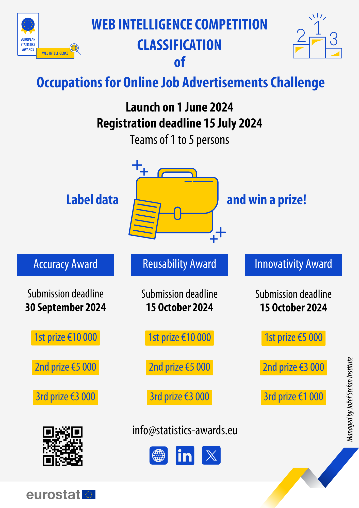

  

# Web Intelligence - Classification Challenge
Organized by EuropeanStatisticsAwards

Link to the competition: https://statistics-awards.eu/competitions/12

# TNO-ISCO08-Predictor

Project part of the [TNO Health and Work AI Lab](https://www.tno.nl/en/healthy/digital-health/health-work-ai-lab/).

Description of the solution can be found here: [Approach Description](classification_approach_description.pdf).

This automated text coding system was also deployed as a [Dash Python](https://dash.plotly.com/) Application and is currently hosted in the [Diamonds Platform](https://diamonds.tno.nl/).

## Dataset Overview

The competition dataset contains 26k online job advertisements (OJA), retrieved from around 400 websites active in the European Union, which have been anonymised for the purposes of the competition (any reference to personal data).

The source of the original dataset is the European Web Intelligence Hub (WIH), where around 200 million online job advertisements have been collected and classified since July 2018. The WIH is a shared infrastructure of the European Statistical System, managed by Eurostat (the statistical office of the European Union) and encompassing the statistical authorities of the European Union Member States. The extraction and use of job advertisements for the labour market and skills intelligence is done in collaboration with Cedefop, the European Centre for the Development of Vocational Training.

## ISCO-08

The International Classification of Occupations (ISCO) seeks to facilitate international communication about occupations by providing statisticians with a framework to make internationally comparable occupational data available, and by allowing international occupational data to be produced in a form that can be useful for research as well as for specific decision-making and action-oriented activities.

The current version, known as ISCO-08, was published in 2008 and is the fourth iteration, following ISCO-58, ISCO-68 and ISCO-88. 

More information about ISCO here: https://ilostat.ilo.org/methods/concepts-and-definitions/classification-occupation/.

##  Authors
Calvin Ge
Gino Kalkman
[Sadegh Shahmohammadi](https://github.com/SadeghNick)
[Xavier Sá Castro Pinho](https://github.com/xavierpinho23/)

Team name: TNO_AI_LAB

